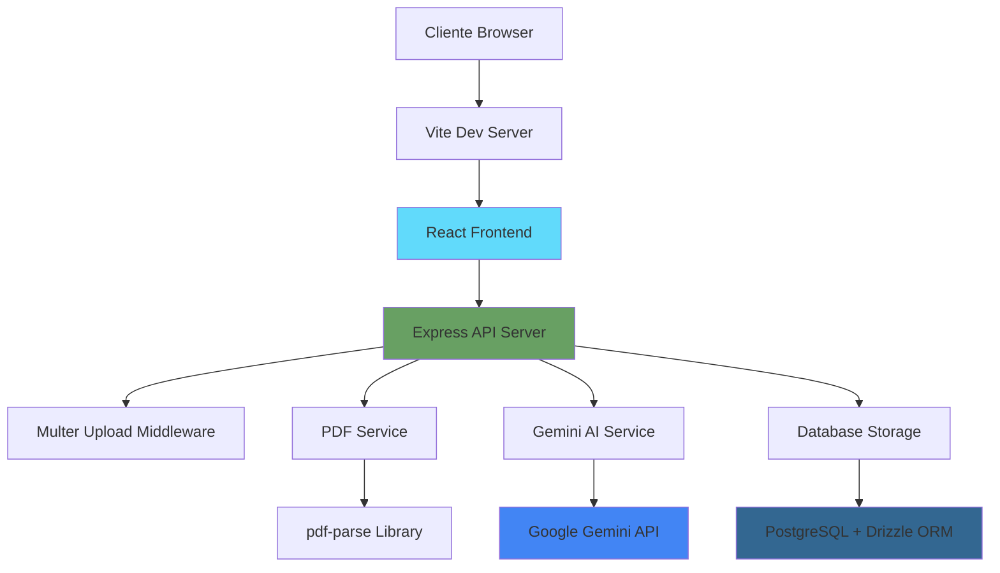
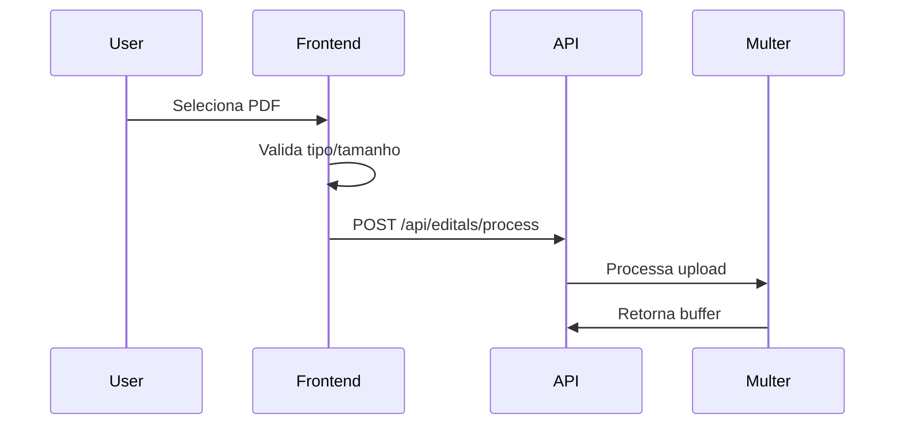
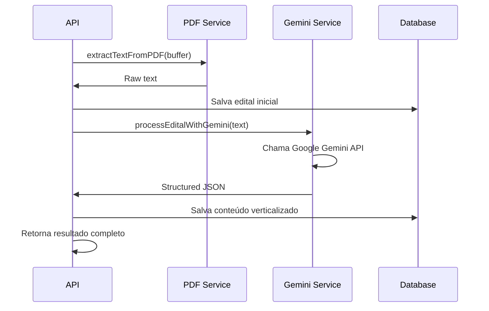
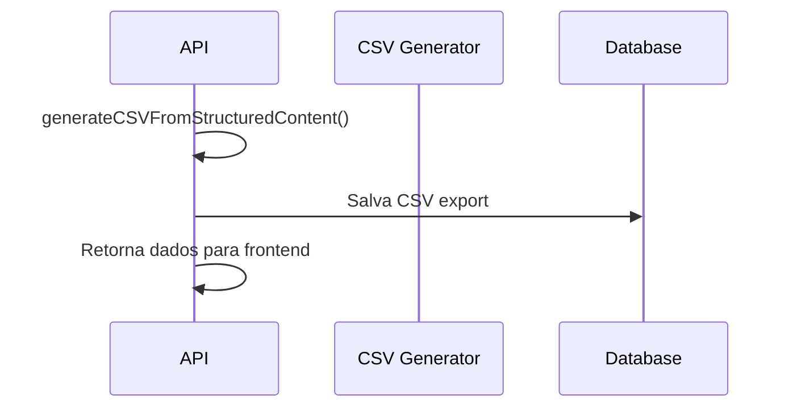

# 🏗️ Arquitetura Técnica - Verticaliza-AI

## Visão Geral da Arquitetura

O Verticaliza-AI segue uma arquitetura moderna de aplicação web full-stack com separação clara de responsabilidades entre frontend, backend e integrações externas.



## Camadas da Aplicação

### 1. Camada de Apresentação (Frontend)

**Tecnologias**: React 18, TypeScript, Tailwind CSS, shadcn/ui

```typescript
// Estrutura dos Componentes
client/src/
├── components/          # Componentes reutilizáveis
│   ├── ui/             # shadcn/ui components
│   ├── upload-section.tsx
│   ├── processing-section.tsx
│   └── results-section.tsx
├── hooks/              # Custom React hooks
├── lib/                # Utilitários e configurações
└── pages/              # Páginas da aplicação
```

**Responsabilidades**:
- Interface de usuário responsiva
- Validação de entrada (client-side)
- Gerenciamento de estado UI
- Comunicação com API backend

**Padrões Aplicados**:
- Component Composition Pattern
- Custom Hooks para lógica compartilhada
- Atomic Design System (via shadcn/ui)

### 2. Camada de API (Backend)

**Tecnologias**: Express.js, TypeScript, Multer

```typescript
// Estrutura do Backend
server/
├── services/           # Serviços de negócio
│   ├── gemini.ts      # Integração IA
│   └── pdf.ts         # Processamento PDF
├── routes.ts          # Definição de rotas
├── storage.ts         # Camada de acesso a dados
└── db.ts              # Configuração do banco
```

**Responsabilidades**:
- Validação e sanitização de entrada
- Orquestração de serviços
- Tratamento de erros centralizados
- Interface com serviços externos

**Endpoints Principais**:
```http
POST /api/editals/process    # Upload e processamento
GET  /api/editals/:id        # Buscar edital
GET  /api/editals/:id/csv    # Download CSV
```

### 3. Camada de Serviços

#### PDF Service
```typescript
// server/services/pdf.ts
export async function extractTextFromPDF(buffer: Buffer): Promise<string>
```

**Responsabilidades**:
- Extração de texto de arquivos PDF
- Validação de formato de arquivo
- Tratamento de erros de parsing

#### Gemini AI Service
```typescript
// server/services/gemini.ts
export async function processEditalWithGemini(text: string): Promise<StructuredContent>
```

**Responsabilidades**:
- Comunicação com Google Gemini API
- Prompt engineering otimizado
- Parsing e validação de resposta JSON
- Retry logic para falhas temporárias

### 4. Camada de Dados

**Tecnologias**: PostgreSQL, Drizzle ORM

```sql
-- Schema Principal
users                   # Usuários (futuro)
editals                 # Metadados dos editais
verticalized_contents   # Conteúdo processado pela IA
```

**Responsabilidades**:
- Persistência de dados estruturados
- Integridade referencial
- Queries otimizadas
- Migrações automáticas

## Fluxo de Processamento

### 1. Upload e Validação


### 2. Processamento de Conteúdo


### 3. Geração de Saída


## Patterns e Princípios Aplicados

### 1. SOLID Principles

**Single Responsibility**
- Cada serviço tem uma responsabilidade específica
- Separação clara entre PDF processing e AI processing

**Open/Closed**
- Storage interface permite extensibilidade
- Service layer pode ser facilmente estendido

**Dependency Inversion**
- Storage abstraction via interface
- Services injetados via importação

### 2. Clean Architecture

```
Domain Models (shared/schema.ts)
     ↑
Application Services (server/services/)
     ↑  
Interface Adapters (server/routes.ts)
     ↑
Framework & Drivers (Express, React)
```

### 3. Error Handling Strategy

```typescript
// Padrão de Error Handling
try {
  const result = await riskyOperation();
  return success(result);
} catch (error) {
  logger.error('Operation failed', { error, context });
  throw new ApplicationError('User-friendly message', error);
}
```

**Níveis de Error Handling**:
1. **Validation Errors**: 400 Bad Request
2. **Business Logic Errors**: 422 Unprocessable Entity  
3. **External Service Errors**: 502 Bad Gateway
4. **System Errors**: 500 Internal Server Error

## Segurança e Performance

### Segurança

**Input Validation**
```typescript
// Validação em múltiplas camadas
const fileValidation = {
  type: 'application/pdf',
  size: { max: 20 * 1024 * 1024 },
  sanitization: true
};
```

**Data Protection**
- Environment variables para secrets
- Sanitização de logs (sem dados sensíveis)
- Rate limiting (futuro)
- CORS configurado

### Performance

**Otimizações Atuais**
- Streaming de arquivos grandes
- Connection pooling no banco
- Limite de texto para IA (50k chars)

**Otimizações Futuras**
- Cache de resultados similares
- Processamento assíncrono
- CDN para assets estáticos
- Database indexing otimizado

## Observabilidade

### Logging Strategy
```typescript
// Structured Logging
logger.info('Edital processed', {
  editalId: 123,
  fileSize: 1024000,
  processingTime: 19.5,
  accuracy: 0.95
});
```

### Métricas Coletadas
- Tempo de processamento por edital
- Taxa de sucesso da IA
- Tamanho médio de arquivos
- Errors por categoria

### Monitoring (Futuro)
- Health checks endpoints
- Application Performance Monitoring
- Real-time alerts
- Dashboard de métricas

## Escalabilidade

### Estratégias Atuais
- Database connection pooling
- Stateless API design
- Environment-based configuration

### Estratégias Futuras

**Horizontal Scaling**
- Load balancer para múltiplas instâncias
- Database read replicas
- Message queue para processamento assíncrono

**Caching Strategy**
```typescript
// Multi-level caching
interface CacheStrategy {
  level1: MemoryCache;    // Resultados recentes
  level2: RedisCache;     // Resultados compartilhados
  level3: DatabaseCache;  // Persistência longa
}
```

**Microservices Migration**
```
API Gateway
├── Auth Service
├── PDF Processing Service
├── AI Processing Service
└── Storage Service
```

## Deployment Architecture

### Current (Single Instance)
```
Replit Instance
├── Frontend (Vite static)
├── Backend (Express server)
└── Database (External PostgreSQL)
```

### Future (Production)
```
Load Balancer
├── Frontend CDN
├── API Instances (N replicas)
├── Background Workers
└── Database Cluster
```

## Decisões Arquiteturais

### Por que Drizzle ORM?
- Type safety superior ao Prisma
- Melhor performance (menos overhead)
- Migrations mais previsíveis
- SQL-first approach

### Por que Google Gemini?
- Melhor performance em texto português
- Modelo multimodal (futuro: OCR)
- API estável e documentada
- Pricing competitivo

### Por que PostgreSQL?
- JSONB para dados semi-estruturados
- ACID compliance
- Escalabilidade horizontal
- Rich ecosystem

## Evolução da Arquitetura

### Fase 1: MVP (Atual)
- Monolito full-stack
- Processamento síncrono
- PostgreSQL simples

### Fase 2: Scale-Up
- Background processing
- Caching inteligente
- Monitoring completo

### Fase 3: Scale-Out  
- Microservices
- Message queues
- Multi-region deployment

---

Esta arquitetura foi projetada para ser simples no início, mas extensível para futuras necessidades de escala e funcionalidades.